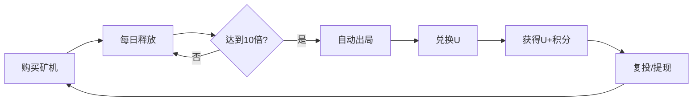

# 🏭 矿机系统配置文档

> **更新时间**: 2025-10-04  
> **版本**: v2.0  
> **状态**: ✅ 已部署

---

## 📊 矿机类型和配置

### 🔷 一型矿机 - 入门级

| 配置项 | 数值 | 说明 |
|--------|------|------|
| **成本** | 100积分 | 购买价格 |
| **每日产出** | 5枚/天 | 固定产出（无加速时） |
| **生产周期** | 20天 | 理论生产时间 |
| **总产出** | 1000积分 | 10倍出局 |
| **ROI** | 10倍 | 投资回报率 |

**适合人群**: 新手用户，试水体验

---

### 🔷 二型矿机 - 进阶级

| 配置项 | 数值 | 说明 |
|--------|------|------|
| **成本** | 1,000积分 | 购买价格 |
| **每日产出** | 20枚/天 | 固定产出（无加速时） |
| **生产周期** | 50天 | 理论生产时间 |
| **总产出** | 10,000积分 | 10倍出局 |
| **ROI** | 10倍 | 投资回报率 |

**适合人群**: 中级用户，稳定收益

---

### 🔷 三型矿机 - 高级

| 配置项 | 数值 | 说明 |
|--------|------|------|
| **成本** | 5,000积分 | 购买价格 |
| **每日产出** | 100枚/天 | 固定产出（无加速时） |
| **生产周期** | 50天 | 理论生产时间 |
| **总产出** | 50,000积分 | 10倍出局 |
| **ROI** | 10倍 | 投资回报率 |

**适合人群**: 高级用户，大额投资

---

## ⚡ 直推加速机制

### 加速公式
```
每日实际产出 = 基础产出 × (基础释放率 + 加速率)
基础释放率 = 1%
加速率 = min(直推数, 20) × 2%
最大加速率 = 40% (20个直推)
```

### 加速效果对比

#### 一型矿机（100积分）

| 直推数 | 加速率 | 每日产出 | 出局天数 | 说明 |
|--------|--------|----------|----------|------|
| 0 | 0% | 1积分 | 1000天 | 无加速 |
| 5 | 10% | 11积分 | 91天 | 5个直推 |
| 10 | 20% | 21积分 | 48天 | 10个直推 |
| 20 | 40% | 41积分 | 25天 | 最大加速 |

#### 二型矿机（1,000积分）

| 直推数 | 加速率 | 每日产出 | 出局天数 | 说明 |
|--------|--------|----------|----------|------|
| 0 | 0% | 10积分 | 1000天 | 无加速 |
| 5 | 10% | 110积分 | 91天 | 5个直推 |
| 10 | 20% | 210积分 | 48天 | 10个直推 |
| 20 | 40% | 410积分 | 25天 | 最大加速 |

#### 三型矿机（5,000积分）

| 直推数 | 加速率 | 每日产出 | 出局天数 | 说明 |
|--------|--------|----------|----------|------|
| 0 | 0% | 50积分 | 1000天 | 无加速 |
| 5 | 10% | 550积分 | 91天 | 5个直推 |
| 10 | 20% | 1,050积分 | 48天 | 10个直推 |
| 20 | 40% | 2,050积分 | 25天 | 最大加速 |

---

## 💰 积分兑换U

### 兑换规则
```
兑换比例: 100积分 = 7U
U分配: 70%转U + 30%转互转积分

计算公式:
实际获得U = 积分 × 0.07 × 0.7
互转积分 = 积分 × 0.3
```

### 兑换示例

#### 一型矿机出局后兑换
```
投入: 100积分
产出: 1000积分
兑换: 
  ├─ 获得U: 1000 × 0.07 × 0.7 = 49U
  └─ 互转积分: 1000 × 0.3 = 300积分

总价值: 49U + 300积分
ROI: 约10倍
```

#### 二型矿机出局后兑换
```
投入: 1000积分
产出: 10,000积分
兑换: 
  ├─ 获得U: 10,000 × 0.07 × 0.7 = 490U
  └─ 互转积分: 10,000 × 0.3 = 3,000积分

总价值: 490U + 3,000积分
ROI: 约10倍
```

#### 三型矿机出局后兑换
```
投入: 5000积分
产出: 50,000积分
兑换: 
  ├─ 获得U: 50,000 × 0.07 × 0.7 = 2,450U
  └─ 互转积分: 50,000 × 0.3 = 15,000积分

总价值: 2,450U + 15,000积分
ROI: 约10倍
```

---

## 🎯 投资策略建议

### 策略1: 保守型（推荐新手）
```
投资组合: 1台一型矿机
初始投入: 100积分
预期周期: 25-91天（根据直推数）
预期收益: 49U + 300积分

优势:
- 投入小，风险低
- 快速体验完整流程
- 适合学习和测试
```

### 策略2: 稳健型（推荐中级）
```
投资组合: 3台一型 + 1台二型
初始投入: 1,300积分
预期周期: 25-91天
预期收益: 637U + 3,900积分

优势:
- 分散风险
- 收益稳定
- 适合长期持有
```

### 策略3: 激进型（推荐高级）
```
投资组合: 1台三型 + 2台二型
初始投入: 7,000积分
预期周期: 25-91天
预期收益: 3,430U + 21,000积分

优势:
- 高收益
- 快速回本
- 适合有充足资金和团队
```

---

## 📈 收益计算器

### 完整案例：20个直推，最大加速

#### 场景设定
- 用户有20个直推
- 加速率: 40%（最大）
- 总释放率: 1% + 40% = 41%

#### 一型矿机收益
```
投入: 100积分
每日产出: 100 × 41% = 41积分/天
出局时间: 1000 ÷ 41 = 25天
总收益: 1000积分
兑换后: 49U + 300积分

日均收益: 1.96U + 12积分
```

#### 二型矿机收益
```
投入: 1,000积分
每日产出: 1,000 × 41% = 410积分/天
出局时间: 10,000 ÷ 410 = 25天
总收益: 10,000积分
兑换后: 490U + 3,000积分

日均收益: 19.6U + 120积分
```

#### 三型矿机收益
```
投入: 5,000积分
每日产出: 5,000 × 41% = 2,050积分/天
出局时间: 50,000 ÷ 2,050 = 25天
总收益: 50,000积分
兑换后: 2,450U + 15,000积分

日均收益: 98U + 600积分
```

---

## 🔄 矿机生命周期



### 阶段说明

1. **购买阶段**
   - 选择矿机类型
   - 消耗相应积分
   - 矿机开始运行

2. **释放阶段**
   - 每日零点自动释放
   - 释放量 = 投入 × (1% + 加速率)
   - 自动增加到积分余额

3. **出局阶段**
   - 达到10倍总量自动出局
   - 矿机状态变为"已出局"
   - 停止释放

4. **兑换阶段**
   - 使用矿机产出积分兑换U
   - 70%转为U余额
   - 30%转为互转积分

5. **复投阶段**
   - 使用互转积分购买新矿机
   - 或使用U提现/转账

---

## 🛠️ 系统限制

| 限制项 | 数值 | 说明 |
|--------|------|------|
| 最大矿机数 | 50台/用户 | 防止系统过载 |
| 最大加速直推 | 20个 | 加速率上限40% |
| 最低兑换 | 100积分 | 兑换门槛 |
| 兑换倍数 | 100的倍数 | 兑换单位 |

---

## 📝 注意事项

### ⚠️ 重要提示

1. **10倍出局机制**
   - 所有矿机都是10倍出局
   - 达到总量后自动停止
   - 可以复投购买新矿机

2. **加速机制**
   - 直推越多，释放越快
   - 最多20个直推加速
   - 动态更新所有活跃矿机

3. **积分类型**
   - **矿机积分**: 可兑换U
   - **互转积分**: 只能购买/互转

4. **兑换规则**
   - 每次只能兑换70%为U
   - 30%强制转为互转积分
   - 促进社区内循环

---

## 🔧 技术实现

### 核心常量
```typescript
POINTS_PER_MACHINE_TYPE1 = 100
POINTS_PER_MACHINE_TYPE2 = 1000
POINTS_PER_MACHINE_TYPE3 = 5000
EXIT_MULTIPLIER = 10
BASE_RELEASE_RATE = 0.01 (1%)
BOOST_PER_REFERRAL = 0.02 (2%)
MAX_BOOST_REFERRALS = 20
POINTS_TO_U_RATE = 0.07
U_PERCENTAGE = 0.7
POINTS_PERCENTAGE = 0.3
```

### 文件位置
- 业务逻辑: `src/services/mining.service.ts`
- UI界面: `src/views/points/PointsView.vue`
- 单元测试: `tests/unit/mining.test.ts`
- 数据库Schema: `supabase/schema.sql`

---

## 📊 总结对比表

| 矿机类型 | 成本 | 每日基础产出 | 周期 | 总产出 | 兑换U | 互转积分 |
|---------|------|-------------|------|--------|-------|----------|
| 一型 | 100 | 5枚 | 20天 | 1,000 | 49U | 300 |
| 二型 | 1,000 | 20枚 | 50天 | 10,000 | 490U | 3,000 |
| 三型 | 5,000 | 100枚 | 50天 | 50,000 | 2,450U | 15,000 |

**备注**: 以上数据均为无加速情况，实际收益根据直推数会有显著提升。

---

**最后更新**: 2025-10-04  
**配置版本**: v2.0  
**测试状态**: ✅ 14/14测试通过


